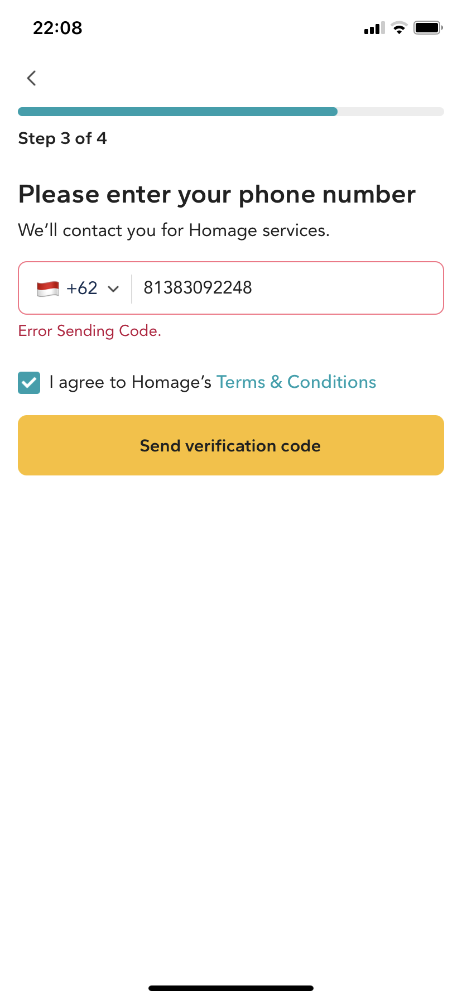

# Homage challenge answer

```bash
Bug Reporting

Title : if user send otp with the initial country phone number using other than australia, singapore, malaysia, 
        get errror message "Error Sending Code"

Step to reproduce: 

1. Open the Homage apps
2. Click get started
3. Click continue with anything (apple / google / facebook / continue with email)
4. Click care needed with any country option ( singapore / malaysia / australia )
5 Change the initial country phone number using other than australia, singapore, malaysia
6. Click agree checkbox
7. Click send verification code

Expected result : 
otp send and redirected to input otp page

Actual result : 
get errror message "Error Sending Code"

Affected Device : Iphone X, iOS 15.1

Network : Home Wi-fi

Severity : medium

Priority : low

Impact : anyone using number other than australia, singapore, malaysia cannot register

```

